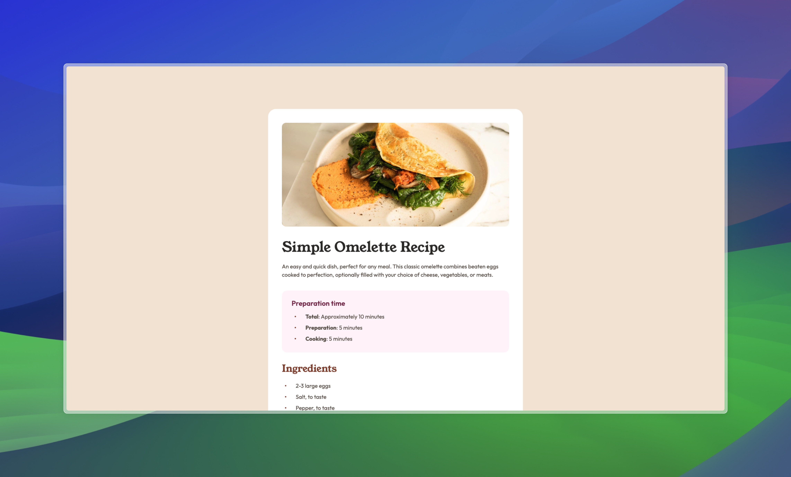

# Frontend Mentor - Recipe page solution

This is a solution to the [Recipe page challenge on Frontend Mentor](https://www.frontendmentor.io/challenges/recipe-page-KiTsR8QQKm). Frontend Mentor challenges help you improve your coding skills by building realistic projects. 

## Table of contents

- [Overview](#overview)
  - [The challenge](#the-challenge)
  - [Screenshot](#screenshot)
  - [Links](#links)
- [My process](#my-process)
  - [Built with](#built-with)
  - [What I learned](#what-i-learned)
- [Author](#author)

## Overview

### The Challenge

Your challenge is to build out this recipe page and get it looking as close to the design as possible.

### Screenshot

### Links

- Solution URL: [https://www.frontendmentor.io/solutions/repsonsive-one-pager-with-scss-and-vue-HLUJQE2SbI](https://www.frontendmentor.io/solutions/repsonsive-one-pager-with-scss-and-vue-HLUJQE2SbI)
- Live Site URL: [https://dafailer-recipe-page.netlify.app/](https://dafailer-recipe-page.netlify.app/)

## My process

### Built with

- Semantic HTML5 markup
- CSS Grid
- [Vue](https://vuejs.org/) - JS library
- [Vite](https://vitejs.dev/) - JS library
- [Fontsource](https://fontsource.org/fonts/outfit/install)

### What I learned

- Setting up an evironment with Netlify
- Using Fontsource for self hosted fonts

## Author

- Website - [Michael Vogtherr](https://github.com/daFailer)
- Frontend Mentor - [@daFailer](https://www.frontendmentor.io/profile/daFailer)
